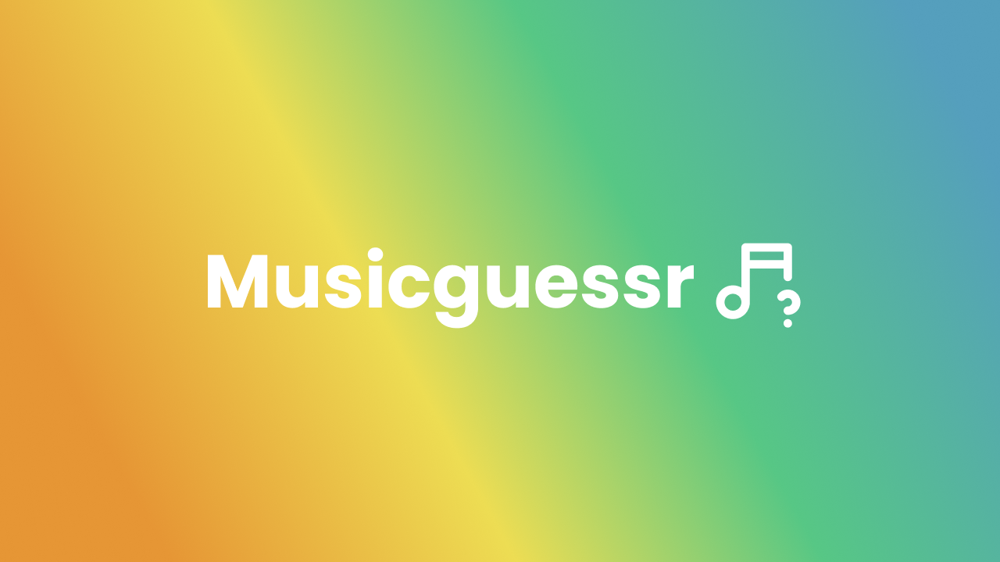
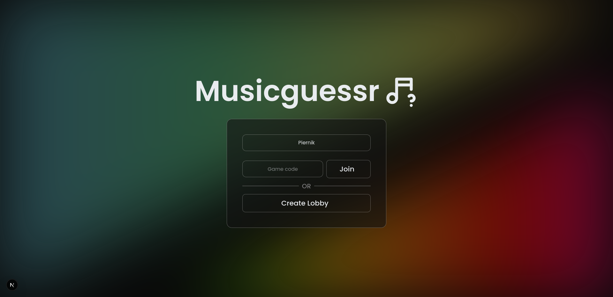
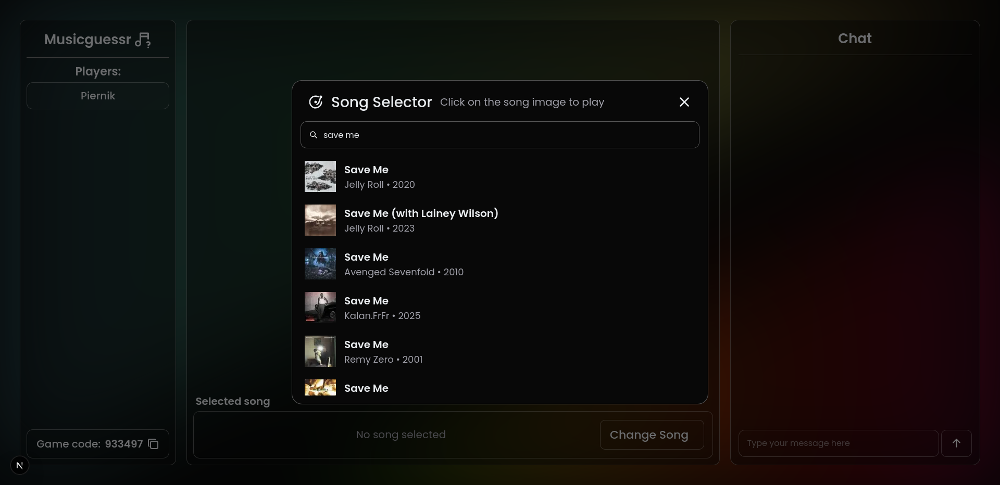
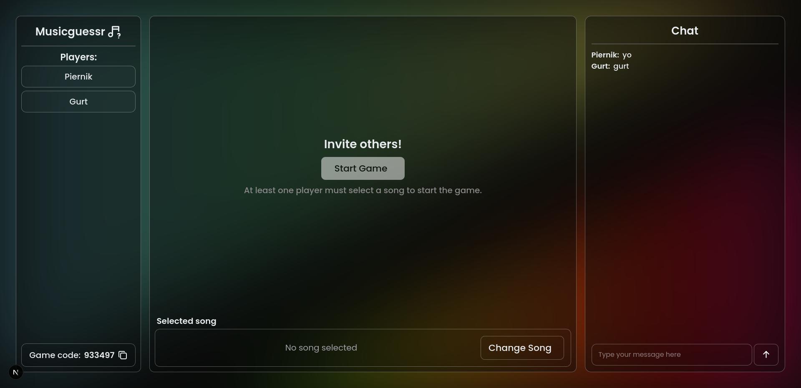
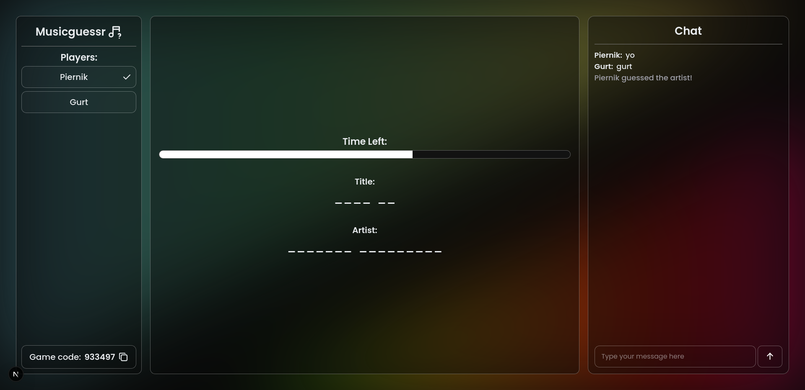
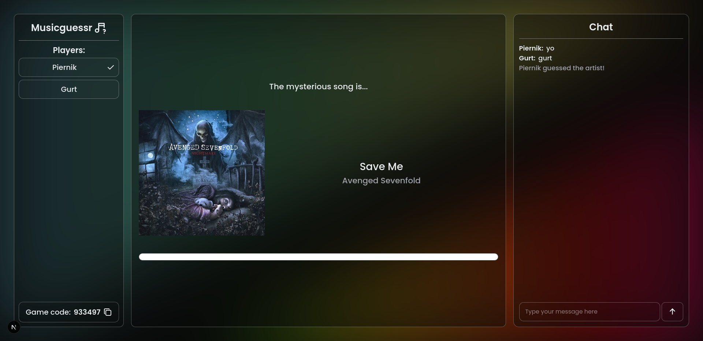

# Musicguessr



Guess your friends' favorite music — together!

**This is a game where you and your friends choose your music and guess each other's pick**

## You can play this game [here](https://musicguessr.piernik.rocks)

## Features

-   Joining with game code
    
-   Itunes music library
    
-   In game chat
    
    
    

## Host it yourself:

You can host it by yourself with docker!

_If you want to use something different than traefik, you need to adjust compose file for your needs._

### Dependencies:

-   [docker](https://docs.docker.com/engine/install/)
-   [traefik](https://doc.traefik.io/traefik/getting-started/install-traefik/)

### Run:

```bash
# You need to create an empty folder for mongodb data, because mongo won't do it itself
mkdir db
docker-compose up -d
```

## Development:

### Dependencies:

-   [pnpm](https://pnpm.io/installation)
-   [rust/cargo](https://rust-lang.org/tools/install/)
-   [caddy](https://caddyserver.com/)
-   [mongodb](https://www.mongodb.com/docs/manual/installation/)

### Run:

**web**

```bash
cd web/
pnpm i
pnpm dev
```

**api**

```bash
cd api/
echo "MONGODB_URI=mongodb://localhost:27017" > .env
cargo run
```

**caddy** - mixing api and web together on one port

```bash
caddy run
```
